# Monitoring

The result of the work must be a report with detailed descriptions of the implementation of each of the points with screenshots. The report is prepared as a markdown file in the `src` directory named `REPORT.MD`.

## Part 1. Getting metrics and logs

1) Use the docker swarm from the [project](https://github.com/Dimiiske/container-orchestration-basics). 

2) Use the Micrometer library to write the following application metrics collectors: 
   - number of messages sent to rabbitmq;
   - number of messages processed in rabbitmq;
   - number of bookings;
   - number of requests received at the gateway;
   - number of user authorization requests received.

To determine which services need to collect metrics, I will use the diagram from the [project](https://github.com/Dimiiske/container-orchestration-basics)

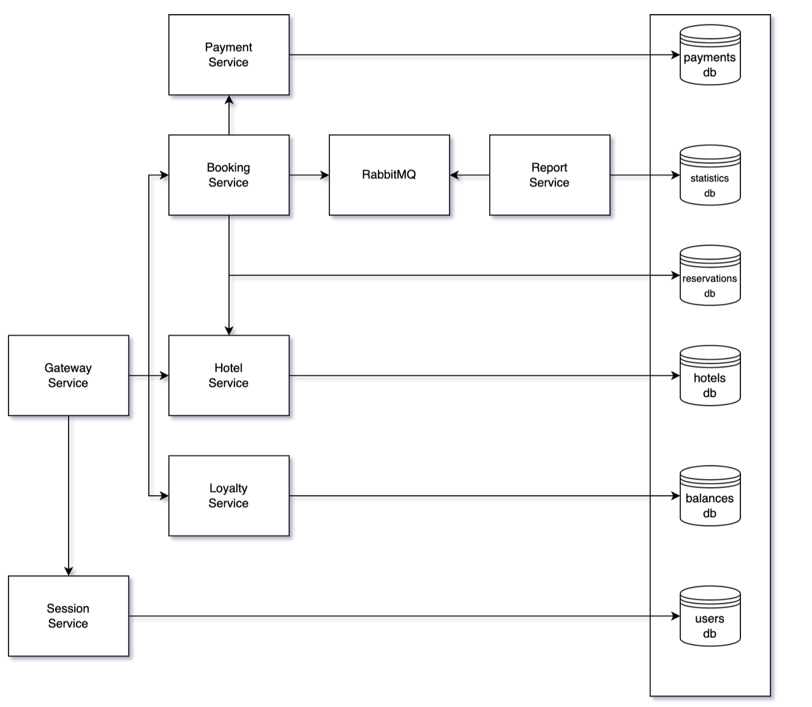

I need to configure the collection of metrics from services:
   - gateway-service;
   - session-service;
   - booking-service;
   - report-service.

Add dependencies actuator, micrometer in the files pom.xml:

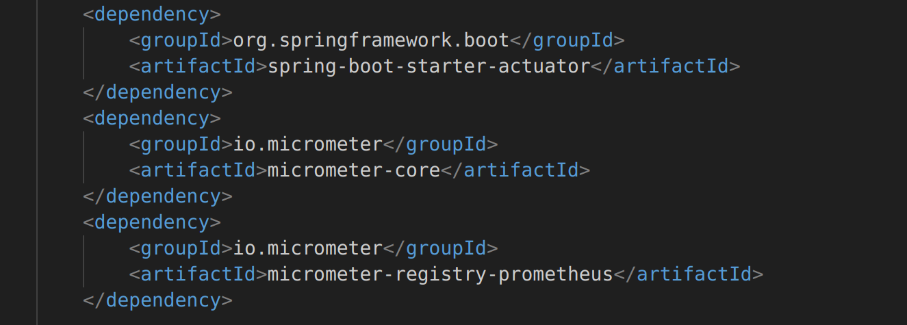

Add an endpoint in the file `application.properties`:

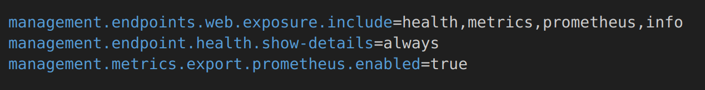

Ru-Documentation [Spring-boot metrics](https://habr.com/ru/articles/548700/)

3) Add application logs using Loki.

Install Loki driver. [Documentation](https://grafana.com/docs/loki/latest/send-data/docker-driver/)

Create a file at /etc/docker/daemon.json and add the configuration:

```
{
    "debug" : true,
    "log-driver": "loki",
    "log-opts": {
        "loki-url": "http://localhost:3100/loki/api/v1/push",
        "loki-batch-size": "400"
    }
}
```

[Documentation](https://grafana.com/docs/loki/latest/send-data/docker-driver/configuration/)

4) Create a new stack for the docker swarm of services with Prometheus Server, Loki, node_exporter, blackbox_exporter, cAdvisor. Check receiving metrics on port 9090 via a browser.

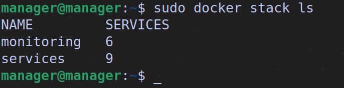

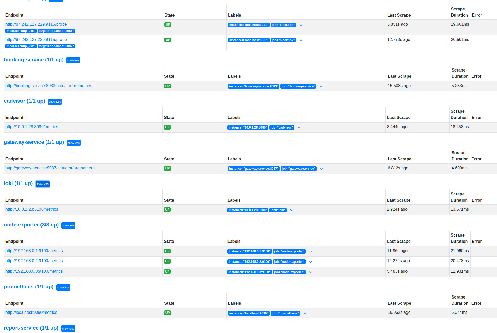

## Part 2. Visualization

1) Deploy grafana as a new service in the monitoring stack.

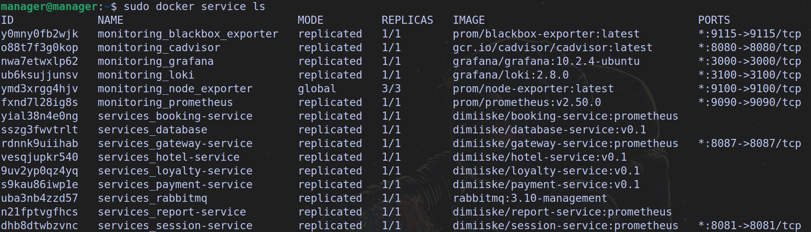

2) Add a dashboard with the following metrics to grafana:
   - number of nodes;
   - number of containers;
   - number of stacks;
   - CPU usage for services;

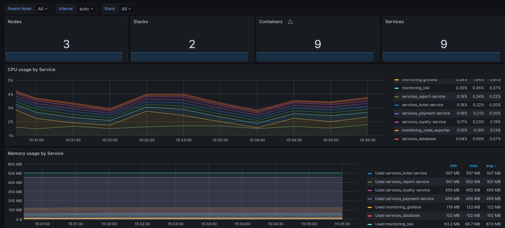

   - CPU usage for cores and nodes;
   - spent RAM;
   - available and used memory;
   - number of CPUs;

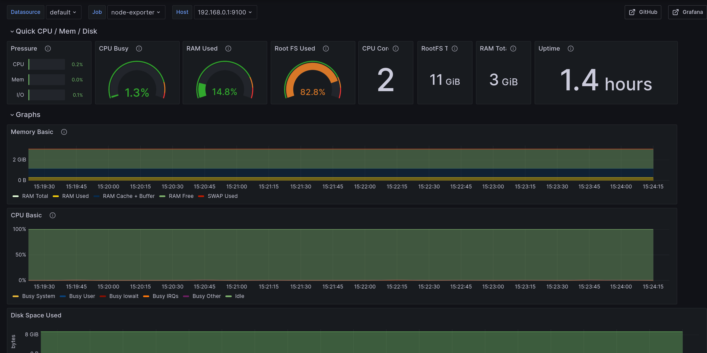

   - google.com availability;

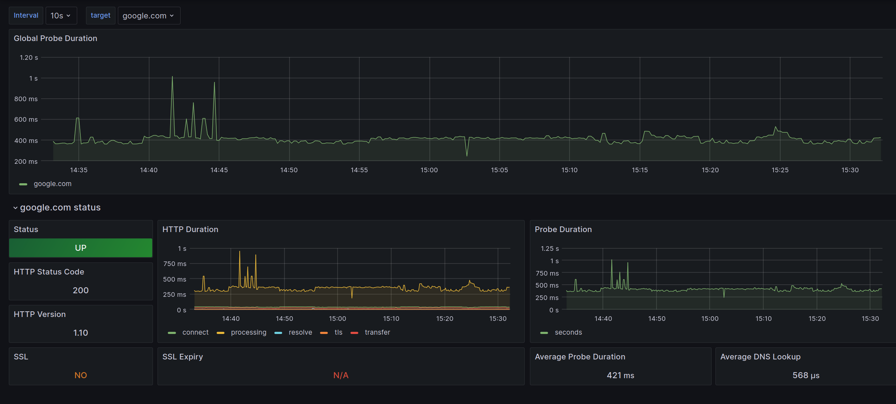

   - number of messages sent to rabbitmq;
   - number of messages processed in rabbitmq;
   - number of bookings;
   - number of requests received at the gateway;
   - number of user authorization requests received;

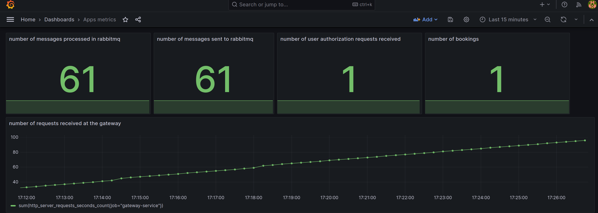

   - application logs.

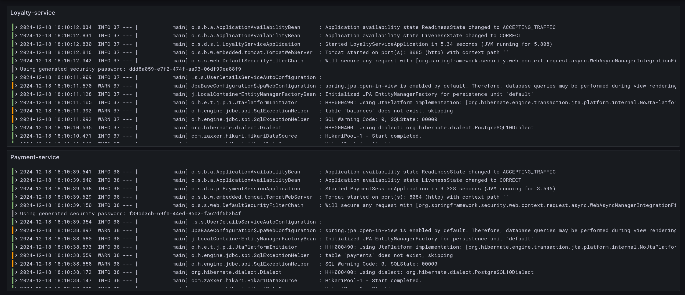
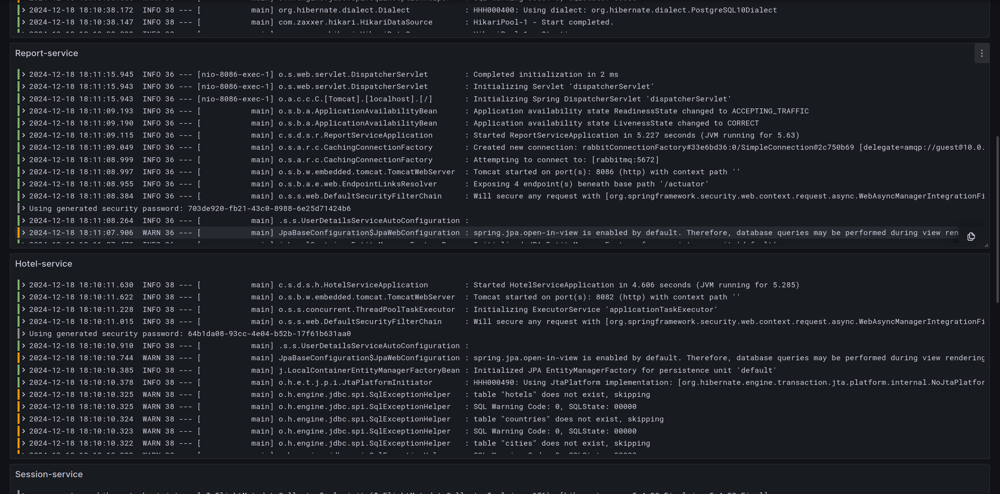

## Part 3. Critical event monitoring

1) Deploy alert manager as a new service in the monitored stack.

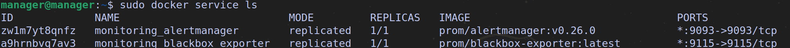

2) Add the following critical events:
   - available memory is less than 100 mb;
   - spent RAM is more than 1gb;
   - CPU usage for the service exceeds 10%.

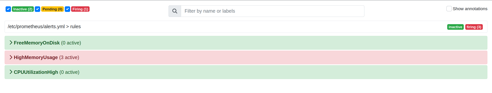

3) Configure notifications via personal email and Telegram.

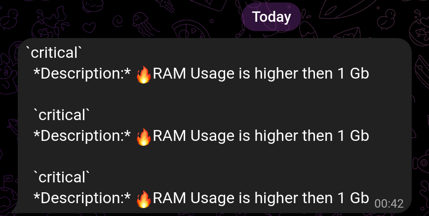

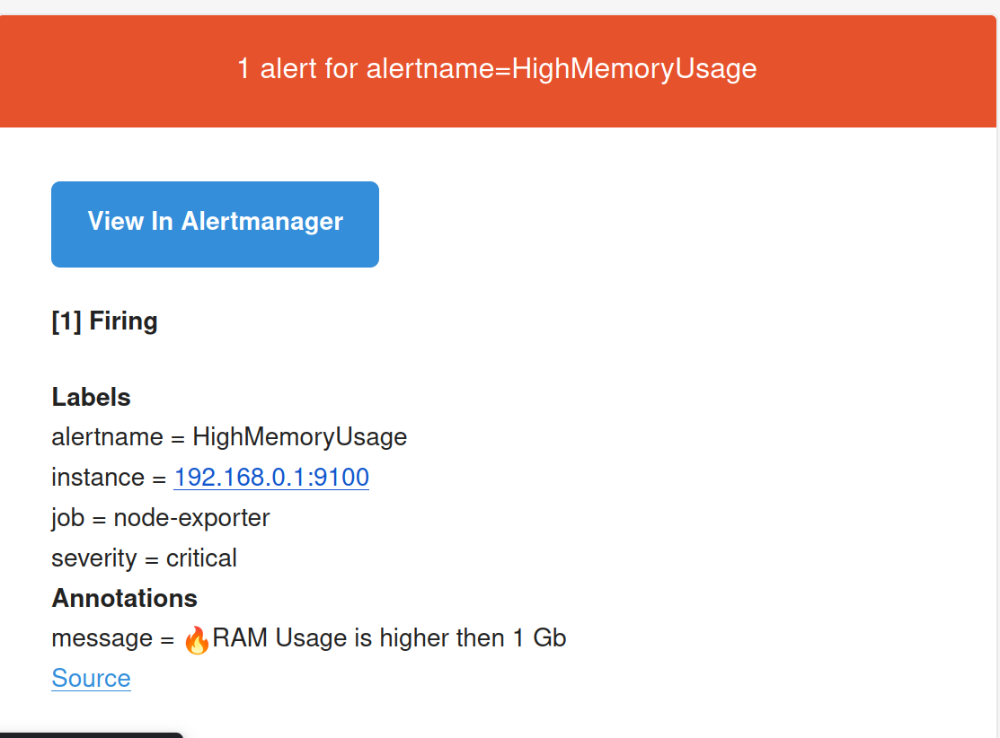